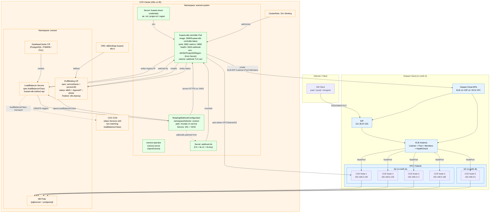

# huawei-elb-controller

**English** | [中文](README-zh.md)

---

## Overview

`huawei-elb-controller` is a Kubernetes controller that automatically creates and manages **Huawei Cloud ELB** (Elastic Load Balancer) instances for [OpenEverest](https://openeverest.io/documentation/current/) database clusters.

The controller uses the **ELBBinding architecture**, built on three core components that work together:

1. **ELBBinding CRD** -- Each LoadBalancer Service gets a corresponding `ELBBinding` custom resource that serves as the **single source of truth** for ELB state (ELB ID, ingress IP, ACL, parameter snapshot). The CRD is linked to the Service via an OwnerReference and exists independently of Service metadata.
2. **Mutating Webhook** -- Intercepts Service CREATE requests in the `everest` namespace and injects `spec.loadBalancerClass: huawei-elb.io/direct-api`. CCE CCM sees the non-matching class and **completely skips** the Service from the source (0 events, no status clearing, no elb.id writes), permanently eliminating the Service status race between the controller and CCM.
3. **Finalizer isolation** -- The cleanup finalizer lives on the `ELBBinding`, not the Service. Even if CCM overwrites the entire Service metadata, the finalizer survives and ELB resources are never leaked.

The controller directly calls the Huawei Cloud ELB v3 API to create the full ELB resource stack (ELB + Listener + Pool + Members + HealthCheck + ACL), without relying on CCM autocreate and without writing any `kubernetes.io/elb.*` annotations.

**Two usage modes**:

- **Auto mode**: Create DBC without LBC -> ELB auto-created (aligns with EKS/GKE experience)
- **Manual mode**: Create LBC as parameter template -> DBC references it -> custom ELB parameters

---

## Features

- **ELBBinding CRD state isolation** -- ELB state stored in an independent CRD, immune to Service metadata overwrites
- **Mutating Webhook blocks CCM at the source** -- Auto-injects `loadBalancerClass`; CCE CCM skips the Service entirely from creation, zero interference and zero noise
- **Finalizer isolation** -- Cleanup finalizer on the ELBBinding, not the Service; survives CCM overwriting Service metadata
- **Direct API management** -- Controller creates/updates/deletes ELB and sub-resources via Huawei Cloud ELB v3 API, no CCM dependency
- **Zero-config auto mode** -- no LBC needed; just create a database and the controller auto-creates an ELB (like EKS/GKE)
- **Manual mode with LBC parameter template** -- LBC stores ELB parameters (bandwidth, EIP type, etc.); each Service gets its own independent ELB with zero port conflicts
- **Auto-detection of VPC/subnet/AZ** -- automatically detects network topology from cluster nodes
- **Node-aware** -- watches node/endpoint changes and syncs ELB backend members
- **ACL auto-handling** -- `loadBalancerSourceRanges` -> IP groups created and bound to all ELB listeners
- **Hot parameter updates** -- modifying LBC or Service annotations triggers live ELB parameter updates via API
- **Orphan resource cleanup** -- When a Service is deleted, the cascading ELBBinding deletion is blocked by the finalizer; the controller detects the orphaned binding, cleans up ELB + EIP + IP groups, then removes the finalizer
- **Duplicate ELB prevention** -- when OpenEverest overwrites the `elb-id` annotation, the controller recovers the association via ELBBinding Status or name-based reverse lookup, avoiding duplicate orphan ELBs

---

## Deployment Architecture



**Legend**: Blue = Huawei Cloud resources, Orange = Kubernetes resources, Green = Controller & Webhook components.

---

## How It Works
## How It Works

### Webhook injection (on Service creation)

```
OpenEverest creates a LoadBalancer Service (in the everest namespace)
        |
        v
  K8s API Server receives the CREATE request
        |
        v
  API Server calls our webhook (https://huawei-elb-controller-webhook:443/mutate)
        |
        v
  Webhook checks:
    1. Is it a CREATE operation?       No  -> allow (no mutation)
    2. Is it type: LoadBalancer?       No  -> allow (no mutation)
    3. Already has loadBalancerClass?  Yes -> allow (no mutation)
    4. Has CCM annotations            Yes -> allow (CCM-managed, don't touch)
       (elb.autocreate or elb.id)?
        | All checks passed
        v
  Inject spec.loadBalancerClass = "huawei-elb.io/direct-api"
        |
        v
  Return patch to API Server
        |
        v
  API Server writes the mutated Service to etcd
        |
        v
  CCM sees non-matching loadBalancerClass -> completely skips   OK
  Controller creates ELB + writes status                       OK
```

> The webhook skips Services that already have `kubernetes.io/elb.autocreate` or `kubernetes.io/elb.id` annotations (CCM-managed Services are unaffected).

### Webhook certificate mechanism

The webhook is called over HTTPS, so the API Server must verify the webhook server's certificate. The `gen-webhook-cert.sh` script handles the full certificate chain in one step:

```
gen-webhook-cert.sh does three things:
  1. Generates a self-signed CA + server certificate
     (CN = huawei-elb-controller-webhook)
  2. Creates Secret huawei-elb-controller-webhook-tls in everest-system
     -> mounted into the controller pod at /tmp/k8s-webhook-server/serving-certs
     -> serves HTTPS on :9443
  3. Patches the CA certificate into MutatingWebhookConfiguration.caBundle
     -> API Server uses this CA to verify the webhook server's certificate
```

> **Install order matters**: `webhook.yaml` must be applied first (creates the MutatingWebhookConfiguration object). Then `gen-webhook-cert.sh` patches that object's `caBundle`. If the cert Secret is missing, the controller pod won't start (volume mount fails). If `caBundle` is empty, the API Server rejects the webhook call (cert verification fails) and Service creation will hang.

### ELB creation (auto mode)

```
Create DBC (LBC = "No configuration")
  -> OpenEverest creates a LoadBalancer Service (webhook injects loadBalancerClass)
  -> Controller creates an ELBBinding CRD (OwnerReference -> Service + cleanup finalizer)
  -> Controller auto-detects VPC/subnet/AZ
  -> Directly calls ELB API: create ELB + Listener + Pool + Members + HealthCheck + ACL
  -> Writes ELBBinding Status (elbID, ingressIP, phase=Ready) + Service annotations + updates Service status
  -> Service gets EXTERNAL-IP ✅
```

### Manual mode (LBC parameter template)

```
Create LBC with huawei-elb.io/* annotations
  -> Create DBC referencing the LBC
  -> OpenEverest syncs annotations to Service
  -> Controller reads params, detects VPC/subnet/AZ
  -> Creates ELBBinding + directly calls ELB API: create independent ELB ✅
```

### Service deletion

```
Delete DBC -> OpenEverest deletes Service
  -> Cascading ELBBinding deletion blocked by finalizer (Service gone, binding remains)
  -> Controller detects orphaned ELBBinding
  -> Cleans up ELB -> EIP -> ACL IP group
  -> Removes ELBBinding finalizer -> ELBBinding deleted ✅
```

### Parameter updates

```
Manual mode: modify LBC annotations -> OpenEverest syncs to Service -> Controller calls API to update bandwidth
Auto mode: annotate the Service directly -> Controller calls API to update ✅
```

---

## Prerequisites

### 1. Kubernetes Cluster

A running Kubernetes cluster with:
- **Huawei Cloud CCE** (or self-managed cluster on Huawei Cloud ECS)
- **StorageClass** configured (for database persistent volumes)

> The controller does **not depend on CCM** for ELB creation -- it calls the Huawei Cloud API directly. The Mutating Webhook makes CCM skip the controller-managed Services from the source, so the two coexist with zero conflict.

OpenEverest is certified on the following platforms:

| Platform | Kubernetes Version |
|---|---|
| Google GKE | 1.31 – 1.33 |
| Amazon EKS | 1.31 – 1.33 |
| OpenShift | 4.16 – 4.18 |

### 2. OpenEverest

OpenEverest must be installed and running in the cluster. The `everest.percona.com/v1alpha1` API group is used.

For installation and the admin password retrieval, see the [OpenEverest documentation](https://openeverest.io/documentation/current/). Quick check:

```bash
kubectl get pods -n everest-system
# Expected: everest-operator and everest-server pods Running

kubectl get dbengine -n everest
# Expected: percona-postgresql-operator, percona-psmdb-operator, percona-pxc-operator
```

### 3. Huawei Cloud Account

- An active Huawei Cloud account with **ELB service enabled**
- **AK** (Access Key) and **SK** (Secret Key) - create at: IAM -> My Credentials -> Access Keys
- **Project ID** - found in the console top-right dropdown under your username

> ⚠️ **Important**: Must use **permanent** AK/SK (main account or IAM user with sufficient permissions). **Temporary AK/SK** (STS tokens) are not supported. Required permissions: ELB Administrator, EIP Administrator, VPC ReadOnly, ECS ReadOnly.

---

## Quick Start

### Step 1: Deploy the Controller

Choose one of two installation methods:

| Method | Description | Recommended |
|---|---|---|
| **A. Raw manifests** | Apply YAML files one by one | ✅ Yes |
| **B. Helm chart** | `helm install` with values.yaml | For Helm users |

Both methods produce the same result. Method A is recommended for transparency and troubleshooting; Method B is for teams already using Helm.

#### Method A: Raw Manifests (Recommended)


```bash
# 1. Build the image
#    Use --provenance=false to avoid SWR's "Invalid image, fail to parse 'manifest.json'" error
git clone https://github.com/weimantian/huawei-elb-controller.git
#    If GitHub is unreachable (e.g. from mainland China), use a mirror:
#    git clone https://ghfast.top/https://github.com/weimantian/huawei-elb-controller.git
cd huawei-elb-controller

# Docker:
docker buildx build --platform linux/amd64 --provenance=false -t huawei-elb-controller:latest .
# nerdctl (containerd-only environments, no Docker):
# nerdctl build --platform linux/amd64 -t huawei-elb-controller:latest .

# 2. Login to SWR and push the image
#    Get the login command from the SWR console overview page
# Docker:
docker login -u <your-namespace> -p <login-token> <swr-registry>
docker tag huawei-elb-controller:latest <swr-registry>/huawei-elb-controller:latest
docker push <swr-registry>/huawei-elb-controller:latest
# nerdctl:
# nerdctl login -u <your-namespace> -p <login-token> <swr-registry>
# nerdctl tag huawei-elb-controller:latest <swr-registry>/huawei-elb-controller:latest
# nerdctl push <swr-registry>/huawei-elb-controller:latest

# 3. Create the credentials Secret
kubectl create secret generic huawei-cloud-credentials \
  --namespace everest-system \
  --from-literal=ak=<your-AK> \
  --from-literal=sk=<your-SK> \
  --from-literal=project-id=<your-ProjectID> \
  --from-literal=region=cn-north-4

# 4. Update the image in deploy/deployment.yaml (line 24):
#    image: <swr-registry>/huawei-elb-controller:latest

# 5. Install the ELBBinding CRD
kubectl apply -f deploy/crd.yaml

# 6. Install RBAC
kubectl apply -f deploy/serviceaccount.yaml
kubectl apply -f deploy/clusterrole.yaml
kubectl apply -f deploy/clusterrolebinding.yaml

# 7. Install the Mutating Webhook
kubectl apply -f deploy/webhook.yaml
bash deploy/gen-webhook-cert.sh    # Generates self-signed cert + Secret + patches caBundle

# 8. Deploy the Controller
kubectl apply -f deploy/deployment.yaml
```

> **Install order**: Credentials Secret -> Image -> CRD -> RBAC -> Webhook (with cert) -> Deployment. The cert script `gen-webhook-cert.sh` must run after `webhook.yaml` is applied -- it creates the TLS Secret and patches the CA bundle into the MutatingWebhookConfiguration.

#### Method B: Helm Chart

```bash
# 1. Build and push the image (same as Method A)
git clone https://github.com/weimantian/huawei-elb-controller.git
cd huawei-elb-controller
docker buildx build --platform linux/amd64 --provenance=false -t huawei-elb-controller:latest .
docker tag huawei-elb-controller:latest <swr-registry>/huawei-elb-controller:latest
docker push <swr-registry>/huawei-elb-controller:latest

# 2. Create a values file with your configuration
cat > my-values.yaml <<EOF
image:
  repository: <swr-registry>/huawei-elb-controller
  tag: latest
  pullPolicy: Always

credentials:
  ak: "<your-AK>"
  sk: "<your-SK>"
  projectId: "<your-ProjectID>"
  region: "cn-north-4"

namespace: everest-system
EOF

# 3. Install the chart
helm install huawei-elb-controller ./charts/huawei-elb-controller \
  -f my-values.yaml

# The chart automatically:
#   - Creates the CRD, RBAC, Deployment, Webhook Configuration, and webhook Service
#   - Generates a self-signed certificate (post-install hook Job) and patches the CA bundle
#   - For production with cert-manager, set webhook.certManager.enabled=true
```

> **Note**: The Helm chart's cert Job uses a `bitnami/kubectl` image to generate the self-signed certificate. If your cluster cannot pull from Docker Hub, either pre-pull this image or use cert-manager (`webhook.certManager.enabled=true`).
### Step 2: Verify the Controller is Running

```bash
kubectl get pods -n everest-system -l app.kubernetes.io/name=huawei-elb-controller
```

Expected:
```
NAME                                     READY   STATUS    RESTARTS   AGE
huawei-elb-controller-xxxxxxxxxx-xxxxx   1/1     Running   0          1m
```

Verify the webhook is active:
```bash
# 1. Check the MutatingWebhookConfiguration exists and has a CA bundle
kubectl get mutatingwebhookconfiguration huawei-elb-controller-webhook
# Expected: NAME                            WEBHOOKS   AGE
#         huawei-elb-controller-webhook   1          <age>

# 2. Check the webhook TLS Secret exists
kubectl get secret huawei-elb-controller-webhook-tls -n everest-system
# Expected: NAME                                TYPE     DATA   AGE
#         huawei-elb-controller-webhook-tls   Opaque   3      <age>

# 3. Check the controller startup log shows the webhook server is serving on :9443
kubectl logs -n everest-system deployment/huawei-elb-controller | grep -E "Registering webhook|Serving webhook"
# Expected:
#   ..."Registering webhook","path":"/mutate-v1-service"
#   ..."Serving webhook server",...,"port":9443
```

Check logs:
```bash
kubectl logs -n everest-system deployment/huawei-elb-controller
```

### Step 3: Update an Existing Controller

When a new version is released and you already have a running controller, update it in place -- no uninstall needed.

```bash
# 1. Pull the latest code
cd huawei-elb-controller
git pull
#    Note: git pull resets deploy/deployment.yaml image to the placeholder.
#    You must restore your real SWR address in step 3 below.

# 2. Build and push the new image to SWR
#    IMPORTANT: you MUST push to SWR -- the cluster pulls from SWR, not your local Docker.
#    Using the same tag (:latest) is fine because imagePullPolicy=Always forces a re-pull.
docker buildx build --platform linux/amd64 --provenance=false -t huawei-elb-controller:latest .
docker tag huawei-elb-controller:latest <swr-registry>/huawei-elb-controller:latest
docker push <swr-registry>/huawei-elb-controller:latest

# 3. Restore your SWR image address in deployment.yaml, then apply
#    git pull resets line 24 to:  image: <swr-registry>/huawei-elb-controller:latest
#    Change it back to your real address, e.g.:  image: swr.cn-north-4.myhuaweicloud.com/<your-namespace>/huawei-elb-controller:latest
sed -i 's|<swr-registry>|swr.cn-north-4.myhuaweicloud.com/<your-namespace>|' deploy/deployment.yaml
kubectl apply -f deploy/deployment.yaml
kubectl apply -f deploy/crd.yaml
kubectl apply -f deploy/webhook.yaml

# 4. Rollout restart to pull the new image
kubectl rollout restart deploy huawei-elb-controller -n everest-system

# 5. Confirm the new pod is running
kubectl rollout status deploy huawei-elb-controller -n everest-system
```

Verify the new image is actually running (the startup log must say **Plan B**, and the webhook server must be serving on :9443):

```bash
kubectl logs -n everest-system deployment/huawei-elb-controller | head -5
# Expected output includes:
#   "Registering webhook","path":"/mutate-v1-service"
#   "starting huawei-elb-controller (Plan B: ...)"
#   "Serving webhook server",...,"port":9443
```

> The update is non-disruptive: existing ELBBindings are preserved, and the controller resumes reconciliation from where it left off. If the webhook cert Secret was removed, re-run `bash deploy/gen-webhook-cert.sh`.

### Step 4: Create a Database (Auto Mode)

The easiest path: create a database cluster without a LoadBalancerConfig.

In the OpenEverest UI, select **"No configuration"** in the Load Balancer Configuration dropdown, or omit `loadBalancerConfigName` in the CR:

```yaml
spec:
  proxy:
    expose:
      type: LoadBalancer
      # loadBalancerConfigName omitted -> auto mode
```

The controller will:
1. Webhook injects `loadBalancerClass` (CCM skips)
2. Create an ELBBinding CRD (OwnerReference + finalizer)
3. Auto-detect VPC, subnet, and availability zones from cluster nodes
4. Call the Huawei Cloud ELB API to create ELB + Listener + Pool + Members + HealthCheck + ACL
5. Write ELBBinding Status (source of truth) + Service annotations (compatibility) + update Service status
6. Service gets EXTERNAL-IP ✅

> **Default parameters**: public ELB, 10 Mbit/s bandwidth, traffic billing, 5_bgp EIP, TCP health check (10s/10s/3 retries).

### Step 5: Get the Connection IP

```bash
# From the Service status
kubectl get svc <service-name> -n everest -o jsonpath='{.status.loadBalancer.ingress[0].ip}'

# Or from the ELBBinding Status (source of truth)
kubectl get elbbinding <service-name> -n everest -o jsonpath='{.status.ingressIP}'
```

For database connection details (passwords, client installation, engine-specific commands), see the [OpenEverest documentation](https://openeverest.io/documentation/current/). Quick reference:

| Engine | Port | Password key | Connect command |
|---|---|---|---|
| PostgreSQL | 5432 | `.data.postgres` | `psql -h <IP> -U postgres -d <db-name>` |
| MySQL / PXC | 3306 | `.data.root` | `mysql -h <IP> -u root -p` |
| MongoDB / PSMDB | 27017 | `.data.clusterAdmin` | `mongosh "mongodb://clusterAdmin:<password>@<IP>:27017/?replicaSet=rs0"` |

Get the password:
```bash
kubectl get secret everest-secrets-<db-name> -n everest -o jsonpath='{.data.<password-key>}' | base64 -d
```

### (Optional) Manual Mode: Using LBC Parameter Template

To customize ELB parameters (bandwidth, billing mode, etc.), create an LBC as a parameter template:

```bash
cat <<'EOF' | kubectl apply -f -
apiVersion: everest.percona.com/v1alpha1
kind: LoadBalancerConfig
metadata:
  name: my-elb-config
spec:
  annotations:
    huawei-elb.io/public: "true"
    huawei-elb.io/bandwidth-size: "20"
    huawei-elb.io/bandwidth-charge-mode: "traffic"
    huawei-elb.io/eip-type: "5_bgp"
EOF
```

Then reference the LBC when creating the DBC (`loadBalancerConfigName: my-elb-config`). The controller reads the LBC parameters and calls the API to create an independent ELB.

> **Important**: LBCs are parameter templates, not instance references. Multiple DBCs referencing the same LBC each get their own independent ELB -- zero port conflicts, fully aligned with EKS/GKE behavior.

---

## Configuration Reference

### Auto Mode Defaults

When no LBC is used (auto mode), the controller applies these defaults:

| Parameter | Default | Description |
|---|---|---|
| ELB type | `public` | Public ELB with EIP |
| Bandwidth | `10` Mbit/s | EIP bandwidth |
| Billing mode | `traffic` | Pay-per-traffic |
| EIP type | `5_bgp` | BGP multi-line |
| ELB name | `k8s-{ns_8}-{name_8}-{uid_10}` | EKS/GKE-aligned naming, truncated to 64 chars |
| Health check | TCP, 10s/10s/3 retries | Aligned with EKS NLB defaults |
| Backend mode | NodePort (node IP + NodePort) | Aligned with GKE default |
| VPC ID | Auto-detected | From node ECS metadata |
| Subnet ID | Auto-detected | From node labels |
| Availability zones | Auto-detected | From node zone labels |

### Manual Mode LBC Annotations

Create an LBC as a parameter template with `huawei-elb.io/*` annotations:

| Annotation | Type | Options | Default | Description |
|---|---|---|---|---|
| `huawei-elb.io/public` | string | `"true"` / `"false"` | `"true"` | `"false"` for internal ELB |
| `huawei-elb.io/bandwidth-size` | int | `1` – `2000` | `10` | EIP bandwidth in Mbit/s |
| `huawei-elb.io/bandwidth-charge-mode` | string | `"traffic"` / `"bandwidth"` | `"traffic"` | Billing mode |
| `huawei-elb.io/eip-type` | string | `"5_bgp"`, `"5_sbgp"`, `"5_telcom"`, `"5_union"` | `"5_bgp"` | EIP line type (immutable after creation) |
| `huawei-elb.io/name` | string | Custom (≤64 chars) | `k8s-{ns_8}-{name_8}-{uid_10}` | ELB instance name |

> **Note**: `eip-type` is immutable after ELB creation (Huawei Cloud API restriction). To change it, delete and recreate the ELB.

### ELBBinding CRD

Each LoadBalancer Service has a corresponding `ELBBinding` resource (same name, same namespace), which is the **single source of truth** for ELB state:

```bash
kubectl get elbbinding -n everest
# NAME                    SERVICE                 ELB-ID                                PHASE    AGE
# mongodb-rs0-0           mongodb-rs0-0           b331e0b2-eae6-4ebe-81b0-9e0e8010f8e3  Ready    5m
```

**Spec fields**:

| Field | Description |
|---|---|
| `serviceName` | Associated Service name (same name, same namespace, immutable) |
| `serviceUID` | Service UID, guards against Service name reuse (immutable) |

**Status fields** (source of truth):

| Field | Description |
|---|---|
| `elbID` | Huawei Cloud ELB instance ID |
| `ingressIP` | ELB external IP (public EIP or internal VIP) |
| `phase` | `Provisioning` / `Ready` / `Deleting` |
| `aclID` | ACL IP group ID (if source ranges are set) |
| `aclStatus` | `"on"` / `"off"` |
| `aclType` | `"white"` (allow-list mode) |
| `lastKnownParams` | Last synced parameter snapshot (JSON), used for change detection |
| `observedGeneration` | Observed generation |

### Controller-Written Annotations

> The following annotations are written to the Service (for compatibility/visibility), but the **authoritative state lives in ELBBinding Status**. Even if Service annotations are overwritten by OpenEverest, the controller self-heals from ELBBinding Status.

| Annotation | Description |
|---|---|
| `huawei-elb.io/elb-id` | ELB instance ID |
| `huawei-elb.io/last-known-params` | Last synced parameter snapshot (JSON) |
| `huawei-elb.io/acl-id` | ACL IP group ID (if source ranges are set) |
| `huawei-elb.io/acl-status` | `"on"` / `"off"` |
| `huawei-elb.io/acl-type` | `"white"` (allow-list mode) |

> **Finalizer**: `huawei-elb.io/elb-cleanup` is written to the **ELBBinding** (not the Service), ensuring it survives CCM overwriting Service metadata.

### Webhook Injection

The Mutating Webhook intercepts Service CREATE requests in the `everest` namespace and injects:

| Field | Value | Description |
|---|---|---|
| `spec.loadBalancerClass` | `huawei-elb.io/direct-api` | CCM sees the non-matching class and skips the Service entirely |

**Skip conditions** (not injected): The Service already has `kubernetes.io/elb.autocreate` or `kubernetes.io/elb.id` annotations (CCM-managed Services are unaffected).

> ⚠️ **Important**: `region` must match your CCE cluster's region (e.g. `cn-north-4`, `sa-brazil-1`). If the `region` key is missing from the credentials Secret, the controller will fail to start.

> **Credentials Secret keys**: `ak`, `sk`, `project-id`, `region` (see the `kubectl create secret` command in step 3).

---

## Troubleshooting

### Controller Pod Won't Start

```bash
kubectl describe pod -n everest-system -l app.kubernetes.io/name=huawei-elb-controller
```

Common causes:
- **Image not found** -> ensure the image is imported into the cluster
- **Secret missing** -> check credentials Secret exists in `everest-system`
- **Webhook cert Secret missing** -> check `huawei-elb-controller-webhook-tls` Secret exists; if not, re-run `bash deploy/gen-webhook-cert.sh`
- **RBAC insufficient** -> check ClusterRole and ClusterRoleBinding

### ELB Creation Failed

```bash
# Check controller logs for details
kubectl logs -n everest-system deployment/huawei-elb-controller

# Check ELBBinding status
kubectl get elbbinding <service-name> -n everest -o yaml
```

Common errors:
- `network detection failed: ...` -> check that all nodes are in the same VPC; see controller logs for details
- `creating ELB: ...` -> check controller logs for Huawei Cloud API error details (e.g., quota exceeded, insufficient permissions)
- `waiting for ELB active` -> ELB is being provisioned, controller will retry automatically

### Service Has No External IP

```bash
# 1. Check that the webhook injected loadBalancerClass (should return huawei-elb.io/direct-api)
kubectl get svc <service-name> -n everest -o jsonpath='{.spec.loadBalancerClass}'

# 2. Check that the ELBBinding was created and phase=Ready
kubectl get elbbinding <service-name> -n everest

# 3. Check controller logs for ELB creation progress
kubectl logs -n everest-system deployment/huawei-elb-controller

# 4. Check Service events
kubectl describe svc <service-name> -n everest
```

> If `loadBalancerClass` is empty, the webhook is not active. Check that the MutatingWebhookConfiguration exists, the CA bundle is patched, and the webhook pod is Running.

### CCM Interference (Sign of Webhook Not Active)

Under normal operation, the webhook injects `loadBalancerClass` and CCM **completely skips** the Service -- no `GetLoadBalancerFailed` events should appear. If you see the following, the **webhook is misconfigured**:

```bash
# Check for CCM interference events (should be 0 normally)
kubectl get events -n everest --field-selector reason=GetLoadBalancerFailed
```

Troubleshooting steps:
1. `kubectl get mutatingwebhookconfiguration huawei-elb-controller-webhook` -- confirm the webhook config exists
2. `kubectl get secret huawei-elb-controller-webhook-tls -n everest-system` -- confirm the cert Secret exists
3. `kubectl get pod -n everest-system -l app.kubernetes.io/name=huawei-elb-controller` -- confirm pod is Running with port 9443 ready
4. Re-run `bash deploy/gen-webhook-cert.sh` to fix certificates

### ELBBinding Stuck in Deletion

The controller uses a finalizer on the ELBBinding to ensure ELB cleanup. If an ELBBinding is stuck in `Terminating`:

```bash
# Check if the cleanup finalizer is present
kubectl get elbbinding <name> -n everest -o jsonpath='{.metadata.finalizers}'

# Check controller logs for deletion progress
kubectl logs -n everest-system deployment/huawei-elb-controller
```

If the controller has been uninstalled and the finalizer cannot be cleaned up, manually delete the ELB and remove the finalizer:
```bash
# 1. Manually delete the ELB in the Huawei Cloud console (and associated EIP, IP groups)
# 2. Remove the ELBBinding finalizer
kubectl patch elbbinding <name> -n everest --type=merge -p '{"metadata":{"finalizers":[]}}'
```


### EIP Quota Exceeded

Huawei Cloud accounts have a limited EIP quota (default ~5-6). If the quota is full when creating a public ELB, creation will fail:

```
creating ELB: ... Quota exceeded for resources: publicip ...
```

**Solutions**:
1. Release unused EIPs in the Huawei Cloud console (Network -> VPC -> Elastic Public IP)
2. Or use an internal ELB (set `huawei-elb.io/public: "false"`) to avoid consuming EIP quota
3. After freeing quota, the controller will retry creation automatically

> **Tip**: Deleting a DBC triggers the controller to delete the ELB and associated EIP, freeing quota. However, manually created ELBs/EIPs must be cleaned up in the console.

---

## Uninstall

### 1. Delete all Database Clusters First

**Order matters.** Delete the database cluster (DBC) first -- the Service will be deleted, and the controller will automatically delete the Huawei Cloud ELB via the ELBBinding finalizer. If you uninstall the controller first, the ELB becomes an orphaned resource and **continues to incur charges**.

```bash
# List all database clusters
kubectl get dbc -A

# Delete each one (Service deletion triggers controller ELB cleanup)
kubectl delete dbc <name> -n <namespace>

# Confirm all ELBBindings are cleaned up
kubectl get elbbinding -A
# Expected: no resources

# Delete any remaining LBCs
kubectl get loadbalancerconfig -A
kubectl delete loadbalancerconfig <name>
```

```bash
kubectl delete -f deploy/deployment.yaml
kubectl delete -f deploy/webhook.yaml
kubectl delete -f deploy/clusterrolebinding.yaml
kubectl delete -f deploy/clusterrole.yaml
kubectl delete -f deploy/serviceaccount.yaml
kubectl delete secret -n everest-system huawei-cloud-credentials
kubectl delete secret -n everest-system huawei-elb-controller-webhook-tls
```

### 3. (Optional) Remove the CRDs

This permanently removes the `ELBBinding` and `LoadBalancerConfig` custom resource definitions. Skip this step if you plan to reinstall.

```bash
kubectl delete crd elbbindings.huawei-elb.io
kubectl delete crd loadbalancerconfigs.everest.percona.com
```

---

## Comparison with EKS/GKE

On Amazon EKS and Google GKE, creating a `type: LoadBalancer` Service automatically creates a cloud load balancer -- no extra controller needed. This controller provides the same experience for Huawei Cloud CCE:

| Feature | EKS / GKE | CCE + This Controller |
|---|---|---|
| Extra controller deployment | Not needed | Needed |
| User configures VPC/subnet/AZ | No | **No (auto-detected)** |
| Configuration complexity | Zero | **Zero** |
| LBC role | Parameter template | **Parameter template** ✅ |
| Multiple Services per LBC | Independent LBs | **Independent ELBs** ✅ |
| ELB creation method | Cloud CCM | **Controller direct API** |
| CCM conflict isolation | N/A | **Webhook source-level blocking** ✅ |
| State storage | Service status | **ELBBinding CRD (isolated)** ✅ |
| ELB parameter updates | ✅ (CCM API) | ✅ (Controller API) |
| ELB lifecycle management | CCM | **Controller (ELBBinding finalizer)** |
| Backend member sync | watch nodes/endpoints | **watch nodes/endpoints** |
| ELB naming | `k8s-<ns>-<svc>-<uid>` | **`k8s-{ns_8}-{name_8}-{uid_10}`** ✅ |

---

## License

This project is licensed under the Apache License 2.0. See [LICENSE](LICENSE) for details.
